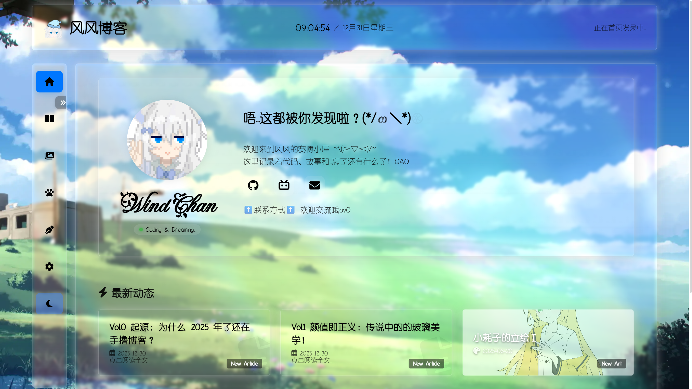
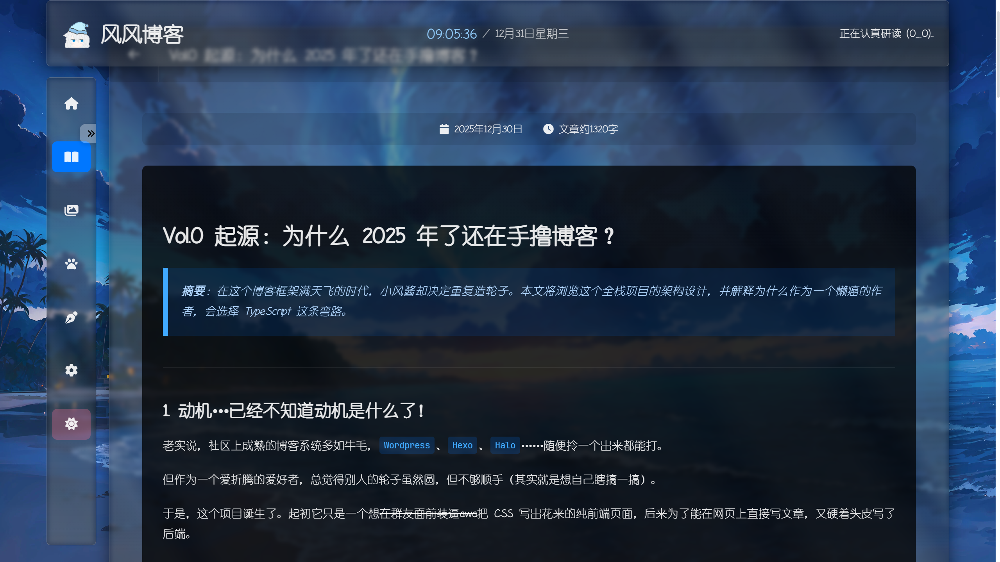

# 🍃 风风博客 (Wind Chan's Blog)


> 一个基于 Vue 3 + TypeScript + Flask 打造的高颜值全栈个人博客系统 ✨
>
> A highly customizable, aesthetic full-stack personal blog built with Vue 3, TypeScript & Flask.

<table>
  <tr>
    <td></td>
    <td></td>
  </tr>
  <tr>
    <td align="center">☀️ 浅色模式</td>
    <td align="center">🌙 深色模式</td>
  </tr>
</table>

---

## 📖 项目简介

这是一个兼具美术风格与流畅交互的个人内容创作平台，从 UI 设计到全栈开发均为独立完成。项目采用前后端分离架构，内置功能完整的在线后台管理系统（CMS），支持在浏览器中直接创作和管理文章。

**核心亮点：**

- **赛博玻璃拟态美学**：深度定制 UI，实现类 Windows Aero 磨砂玻璃质感，支持动态光影反射与亮/暗主题切换。
- **所见即所得编辑器**：编辑模式与预览模式无缝切换，提交前即可看到最终渲染效果。
- **企业级 JWT 认证**：Access Token + Refresh Token 双令牌机制，Axios 拦截器实现无感刷新。
- **开箱即用的演示环境**：内置数据迁移脚本，可一键将 `frontend/legacy_data/` 下的示例文章和资源导入数据库。

---

## 🚀 本地开发启动

> 本节面向在本地运行、体验或二次开发的场景。
> 如需部署到公网服务器，请参阅 [教程文章](#-教程引流) 部分。

### 前置依赖

- `Node.js` v18.0+
- `Python` 3.10+
- `Git`

### Step 1：启动后端

```bash
# 克隆项目
git clone https://github.com/futurelesswindchan/blog0fwindchan.git
cd blog0fwindchan/backend

# 创建并激活虚拟环境
python3 -m venv venv

# Windows
.\venv\Scripts\activate
# Linux / macOS
source venv/bin/activate

# 安装依赖
pip install -r requirements.txt
```

在 `backend/` 目录下新建 `.env` 文件：

```properties
FLASK_DEBUG=True
JWT_SECRET_KEY=<至少32字符的随机字符串，可用下方命令生成>
CORS_ORIGINS=http://localhost:5173
```

生成安全密钥：

```bash
python -c "import secrets; print(secrets.token_hex(32))"
```

初始化数据库并创建管理员账号：

```bash
# 建表 + 写入默认分类
flask db init

# 创建管理员账号（按提示输入用户名和密码）
flask admin create
```

（可选）导入示例文章和演示数据：

```bash
python init_db.py
```

> ⚠️ `init_db.py` 会**清空** Article、Category、Friend、Artwork 表后重新导入，仅适用于首次从 `legacy_data/` 迁移数据。生产环境请勿重复执行。

启动后端：

```bash
python app.py
# 看到 Running on http://127.0.0.1:5000 即为成功
```

### Step 2：启动前端

另开一个终端窗口：

```bash
cd frontend
npm install
npm run dev
# 前端运行于 http://localhost:5173
```

---

## 🛠️ 技术栈

<details>
<summary>展开查看完整技术细节</summary>

### Frontend

| 技术                           | 描述                                   |
| :----------------------------- | :------------------------------------- |
| `Vue 3`                        | 核心框架，全面使用 Composition API     |
| `TypeScript`                   | 全程类型支持                           |
| `Vite`                         | 构建与开发服务器                       |
| `Pinia`                        | 状态管理                               |
| `Vue Router 4`                 | 路由与后台权限守卫                     |
| `Axios`                        | HTTP 客户端，配置了 JWT 自动刷新拦截器 |
| `Sass (SCSS)`                  | 样式预处理                             |
| `markdown-it` + `highlight.js` | Markdown 渲染与代码高亮                |

### Backend

| 技术                 | 描述                       |
| :------------------- | :------------------------- |
| `Python 3.10+`       | 后端开发语言               |
| `Flask`              | Web 框架                   |
| `SQLite`             | 嵌入式数据库               |
| `SQLAlchemy 2.0`     | ORM，模型定义              |
| `Flask-JWT-Extended` | JWT 认证与 Token 管理      |
| `Flask-Limiter`      | 全局 API 限流              |
| `Marshmallow`        | 请求数据序列化与校验       |
| `python-dotenv`      | 环境变量管理               |
| `Werkzeug ProxyFix`  | Nginx 反向代理真实 IP 透传 |

后端采用模块化蓝图结构：

```
backend/
├── app.py          # 应用工厂 create_app() + CLI 命令注册
├── extensions.py   # db / jwt / limiter 扩展实例
├── models.py       # SQLAlchemy 模型
├── schemas.py      # Marshmallow Schema
└── routes/
    ├── __init__.py # register_routes() 蓝图注册
    ├── public.py   # 公开只读接口
    ├── auth.py     # 登录 / Token 刷新 / 验证
    ├── admin.py    # 管理写入接口
    └── assets.py   # 文件上传
```

</details>

---

## 📚 教程引流

想把博客改成自己的？想部署到公网服务器？

项目内置了完整的教程文章，导入示例数据（`python init_db.py`）后可在博客的"奇怪杂谈"分类中找到；也可以直接在 GitHub 仓库的 `frontend/legacy_data/article/topics/` 目录下查看 Markdown 源文件。

| 教程                                                                                | 内容                                                |
| :---------------------------------------------------------------------------------- | :-------------------------------------------------- |
| [个性化你的博客](frontend/legacy_data/article/topics/how-to-customize-blog.md)      | Fork 仓库、修改站名、头像、壁纸、主题色等           |
| [部署到云服务器](frontend/legacy_data/article/topics/how-to-deploy-on-vps.md)       | Nginx + Gunicorn 生产部署，含完整安全加固与踩坑指南 |
| [日常更新与维护](frontend/legacy_data/article/topics/how-to-update-and-maintain.md) | 代码更新流程、CLI 命令速查、常见问题排错            |

---

## 📄 使用许可

本项目**代码部分**采用 [CC BY-NC-SA 4.0](https://creativecommons.org/licenses/by-nc-sa/4.0/deed.zh) 协议进行许可。欢迎学习、分享和修改，但请注明出处，且不得用于商业用途。

⚠️ **美术资产版权声明**

仓库中包含的所有美术资产（角色立绘、网站 Logo/Icon 等）均受版权保护，**不适用**开源协议。你可以 Clone 用于本地运行、学习和测试，但在将博客正式部署为公开个人站点时，**必须**将这些资产替换为你自己拥有版权或合法使用权的素材。

---

> **Copyright © 2026 没有未来的小风酱 (futurelesswindchan)**
>
> Made with ♡ and lots of —⊂ZZZ⊃.
